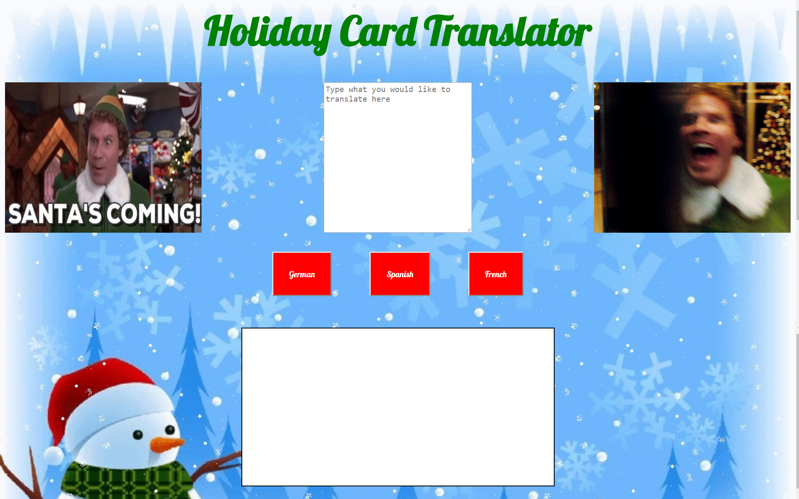

# language-translator

This project was to build a simple language translator for a holiday card. I practiced creating a data structure using objects and building functions and for loops in javascript. I also learned how to add event listeners to buttons.

## How to run this project
* Use npm to install http-server in your terminal:
```sh
npm install -g http-server
```
* Run the server
```sh
hs -p 9999
```
* Open chrome and navigate to:
```
localhost:9999
```

## Screenshots

### Homepage

